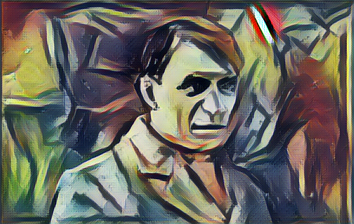

# ArtML Project 1: Style Transfer Self-Portraits

We use style transfer to explore the issue of ownership in AI-generated art and how artists view themselves. Starting with a photo of the artist, we play with generating “self-portraits” in different ways using the artists' self-portraits and other artwork as style images. Can these results be considered “self-portraits” because it is a portrait of the artist done in their own style? By using an artist’s photograph and an actual self-portrait, we also hope to show how the artists’ view of themselves compares to reality. Our results are in the `results` folder.



## Fast Style Transfer
Use bash script `fast-style-transfer/train.sh` to run [Fast Style Transfer with Tensorflow (Engstrom)](https://github.com/lengstrom/fast-style-transfer) with tuned hyperparameters. 

```
sh fast-style-transfer/train.sh
```

## Style Transfer Tensorflow
### Monet
How to run: open jupyter notebook, and input images into the code

Style Transfer
First Iteration
 - Content: monet_photo.jpg
 - Style: monet_portrait.jpg
 - Result: monet_style_transfer.png

Second Iteration
  - Content: monet_style_transfer.png
  - Style: monet_art1.png
  - Result: monet_style_transfer2.png

Third Iteration
  - Content: monet_style_transfe2.png
  - Style: monet_art2.png
  - Result: monet_style_transfer3.png


### Image Averaging - Monet
First run `style_transfer_keras.ipynb`. Put `image-averaging/avgimg.py` with your results in the same directory. Run the code.
It will produce an image with name `avgoutput.png` in your current directory.

## Neural Doodle 
How to run: 

```
./monet_neural_doodle_script.sh
```
